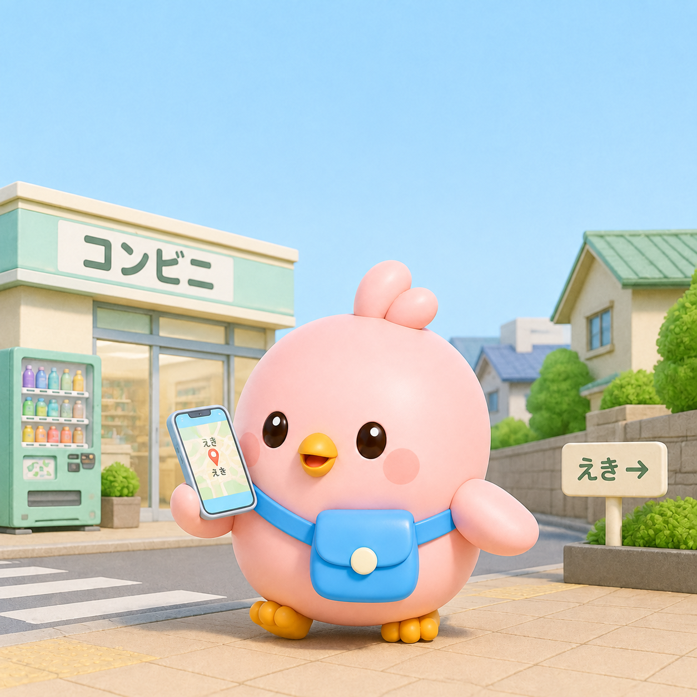

# Momo 日語學習情境生成結果

使用者提供的三張生成圖片，以場景重新命名；作為場景、動作與視覺風格示例，不取代已確認的 IP Bible。這些圖片並非本次重新生成，原始生成提示詞與完整參考圖未隨結果提供，因此不宣稱完整身份驗收通過。

## 街頭導航

## 咖啡廳草莓蛋糕

## 公園飯糰野餐

## 可數特徵觀察

| 圖片 | 畫面左側腳趾 | 畫面右側腳趾 | 羽冠 |
| --- | --- | --- | --- |
| 街頭導航 | 可辨三趾 | 可辨三趾 | 可見兩瓣；正式瓣數待確認 |
| 咖啡廳草莓蛋糕 | 可辨三趾 | 可辨三趾 | 可見兩瓣；正式瓣數待確認 |
| 公園飯糰野餐 | 可辨三趾 | 可辨三趾 | 可見兩瓣；正式瓣數待確認 |

此處左右以觀看圖片的方向為準。腳趾依使用者已確認的「每隻腳固定三根短圓、前向腳趾；坐姿腳掌朝向鏡頭時，三趾都必須清楚可辨，不可合併成兩趾」規則觀察。羽冠僅記錄成圖可見瓣數，不據此新增永久設定；尾羽因構圖無法完整核對。
